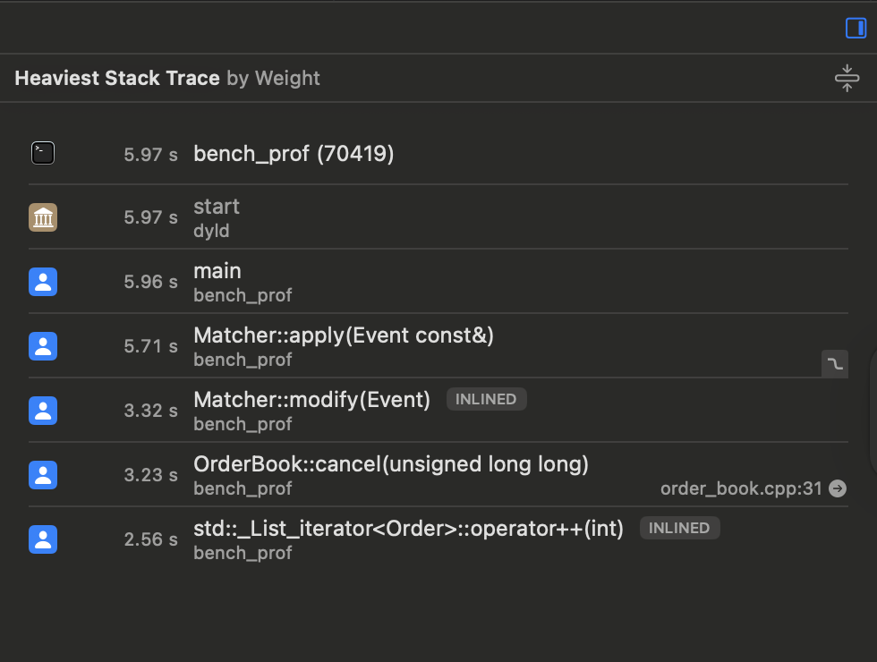

# First phase build
We first see the baseline code. Single threaded with everything that just works. Barely optimised. The onyl optimisations done here are:
- Using ordered and unordered maps for quick lookups
- Using attribute packed for structs that decode from byte streams
- Pass and use references

Run the following to get benchmarks
```shell
g++ -std=c++20 -O3 -march=native -I include/ob \
    bench/bench_sweep.cpp src/matcher.cpp src/order_book.cpp src/decoder.cpp -o bench_sweep && ./bench_sweep

g++ -std=c++20 -O3 -march=native -I include/ob \
    bench/bench_latency.cpp src/matcher.cpp src/order_book.cpp src/decoder.cpp -o bench_latency && ./bench_latency

```
---

|   N|   add ns/op | cancel ns/op   | modify ns/op     | events/sec|
|---|---|---|---|---|
|      10|   200.0|   0.0|     0.0|  5000000  (noisy)|
|     100|   209.3| 136.4|   257.1|  5000000  (noisy)|
|    1000|   303.6| 112.7|   328.6|  3816794|
|    5000|   294.2|  99.3|   317.1|  3796507|
|   10000|   234.6|  87.3|   255.6|  4734848|
|   50000|   179.3|  92.8|   210.9|  5849321|

---
|Metric| Time |
|---|---|
|samples            | 1800000   |
|mean      (ns)     | 1891.6    |
|min       (ns)     | 0 |
|p50       (ns)     | 0 |
|p90       (ns)     | 4000  |
|p99       (ns)     | 32000 |
|p99.9     (ns)     | 60000 |
|p99.99    (ns)     | 113000    |
|max       (ns)     | 5968000   |


for full Profiling on mac
```
brew install hdrhistogram_c          # optional
xcode-select --install               # for Instruments
```

```
# each run (from project root)
g++ -std=c++20 -O3 -march=native -I include/ob bench/bench_sweep.cpp   src/*.cpp -o bench_sweep   && ./bench_sweep
g++ -std=c++20 -O3 -march=native -I include/ob bench/bench_latency.cpp src/*.cpp -o bench_latency && ./bench_latency
```
# profile
```
g++ -std=c++20 -O2 -g -march=native -I include/ob bench/bench_latency.cpp src/*.cpp -o bench_prof
xcrun xctrace record --template 'Time Profiler' --launch -- ./bench_prof && open *.trace
```

This will give something like this


Instrument also gives us something like this


We will employ this to find optimisations down the line


# Second Pass

In the second part we will try optimisations and try to beat the performance of the previous design. The metric we would like to measure by is time (and maybe memory? as low memory usage may help us make use of caching more than memory)

First Point fo interest is the operator++ which is essentially pointing to our walk of the PriceLevel List

So now we will save an interator pointer to the list node as well. This could have potential issues in the form of dangling pointers... let's see if I have to use shared_ptr/unique_ptr/weak_ptr

Special Pointers were not needed as list deletes cleanly.

After making a simple change of less than 5 lines -> linear scan of price level for order ID, saving iterator and using that to delete saves ~46% of the runtime. 

Now that we have done some complexity level optimisations, lets move on to more niche attempts.

# Third Phase

In this phase I parallelised the engine, separating feed consumption from order matching across two threads, connected by a lock-free single-producer/single-consumer (SPSC) ring buffer. One thread decodes events and writes them to the head of the ring; the other consumes from the tail and runs the matcher. The indices are monotonic and wrap via a module mask; the producer spins when the ring is full and the consumer spins when it's empty. Correctness is verified under ThreadSanitizer — 5M+ events across both threads with no data races and identical trade output to the single-threaded engine.
The result was ~12× slower... which I sort of expected. Per-event work (decode + match) is only ~130 ns, but each hand-off across the ring costs a fair bit of overhead (perhaps cross-core communication, I doubt cache coherency is the culprit) that dominates. When one stage does nearly all the work and the other is trivial, there's nothing to overlap; we just pay the queue tax. Threading a pipeline pays off when each stage does substantial, overlappable work, or when the producer is genuinely I/O-bound (e.g. a feed arriving over a socket/NIC), so the consumer overlaps with wait time. My in-memory replay models neither, so single-threaded wins. But why exactly is a question I want to explore. Currently, I am on an apple silicon which does not let me run the populsrised `perf c2c` profiling tool so I will see what instruments will turn up.