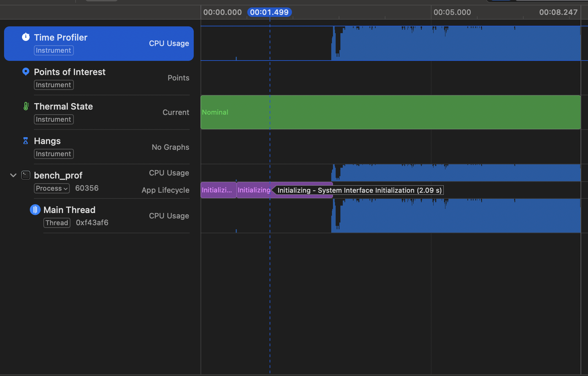

# First phase build
We first see the baseline code. Single threaded with everything that just works. Barely optimised. The onyl optimisations done here are:
- Using ordered and unordered maps for quick lookups
- Using attribute packed for structs that decode from byte streams
- Pass and use references

Run the following to get benchmarks
```shell
g++ -std=c++20 -O3 -march=native -I include/ob \
    bench/bench_sweep.cpp src/matcher.cpp src/order_book.cpp src/decoder.cpp -o bench_sweep && ./bench_sweep

g++ -std=c++20 -O3 -march=native -I include/ob \
    bench/bench_latency.cpp src/matcher.cpp src/order_book.cpp src/decoder.cpp -o bench_latency && ./bench_latency

```
---

|   N|   add ns/op | cancel ns/op   | modify ns/op     | events/sec|
|---|---|---|---|---|
|      10|   200.0|   0.0|     0.0|  5000000  (noisy)|
|     100|   209.3| 136.4|   257.1|  5000000  (noisy)|
|    1000|   303.6| 112.7|   328.6|  3816794|
|    5000|   294.2|  99.3|   317.1|  3796507|
|   10000|   234.6|  87.3|   255.6|  4734848|
|   50000|   179.3|  92.8|   210.9|  5849321|

---
|Metric| Time |
|---|---|
|samples            | 1800000   |
|mean      (ns)     | 1891.6    |
|min       (ns)     | 0 |
|p50       (ns)     | 0 |
|p90       (ns)     | 4000  |
|p99       (ns)     | 32000 |
|p99.9     (ns)     | 60000 |
|p99.99    (ns)     | 113000    |
|max       (ns)     | 5968000   |


for full Profiling on mac
```
brew install hdrhistogram_c          # optional
xcode-select --install               # for Instruments
```

```
# each run (from project root)
g++ -std=c++20 -O3 -march=native -I include/ob bench/bench_sweep.cpp   src/*.cpp -o bench_sweep   && ./bench_sweep
g++ -std=c++20 -O3 -march=native -I include/ob bench/bench_latency.cpp src/*.cpp -o bench_latency && ./bench_latency
```
# profile
```
g++ -std=c++20 -O2 -g -march=native -I include/ob bench/bench_latency.cpp src/*.cpp -o bench_prof
xcrun xctrace record --template 'Time Profiler' --launch -- ./bench_prof && open *.trace
```

This will give something like this



# Second Pass (In progress)

In the second part we will try optimisations and try to beat the performance of the previous design. The metric we would like to measure by is time (and maybe memory? as low memory usage may help us make use of caching more than memory)